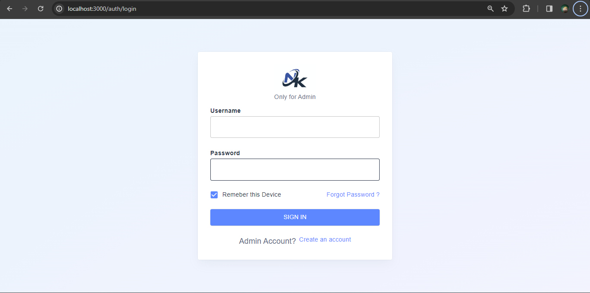
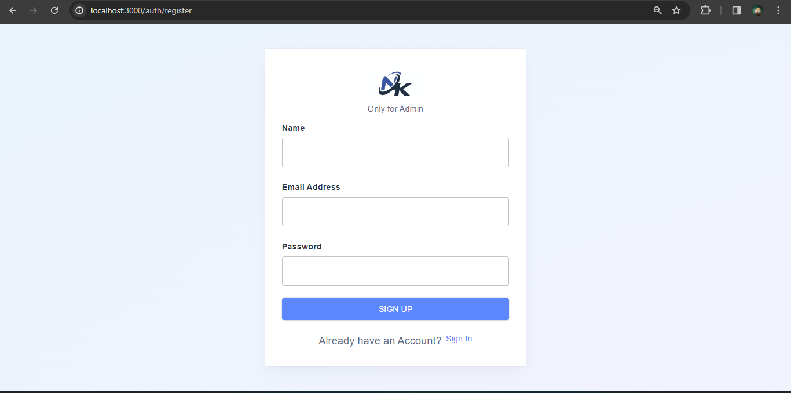
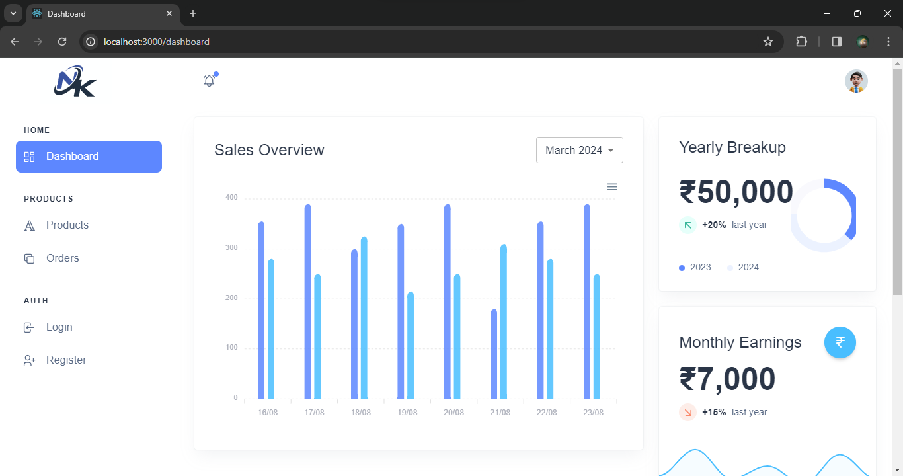
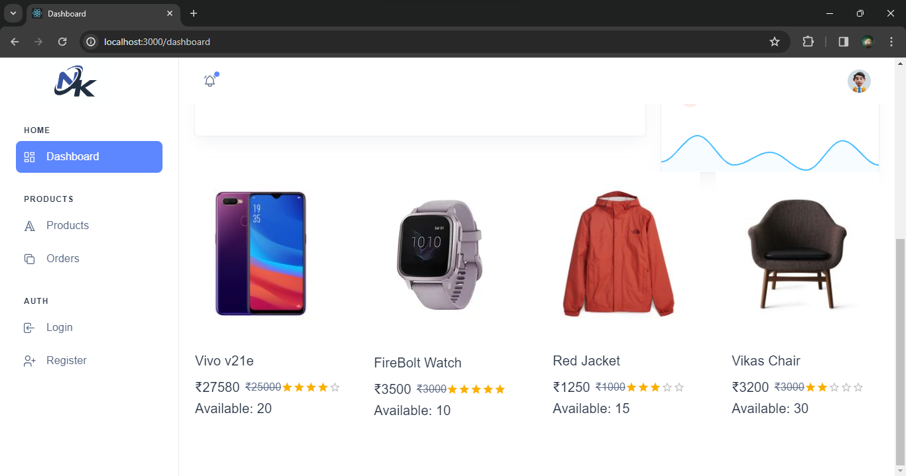
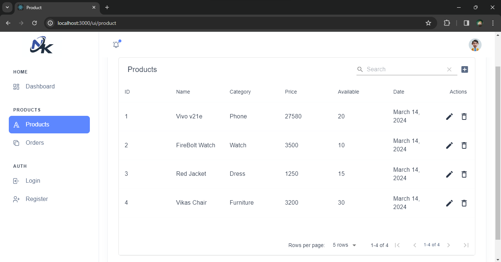
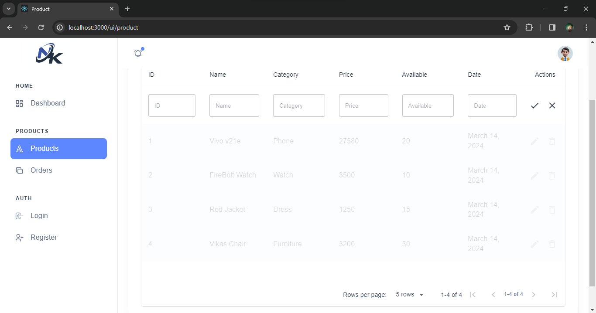
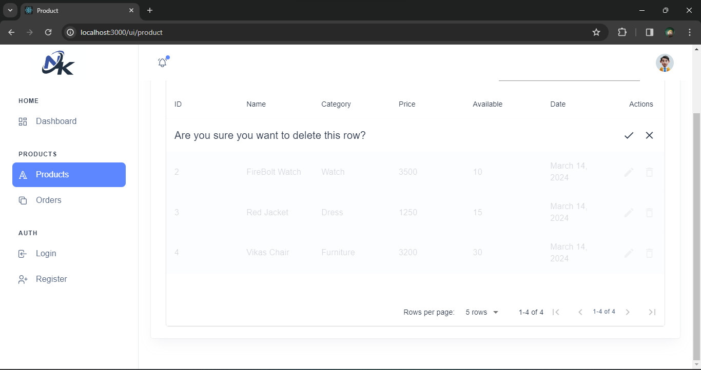
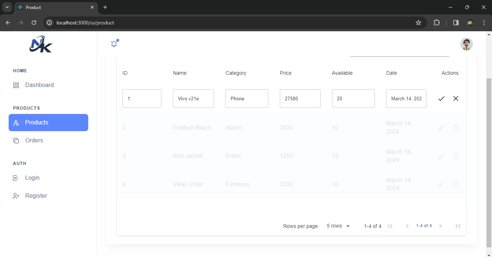
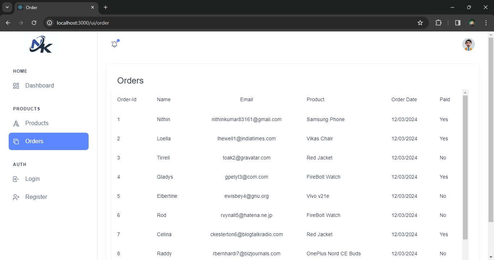

# ERP System with React and Material-UI

This project is a simplified ERP (Enterprise Resource Planning) system front-end built using React and Material-UI. The system allows Admin to view, add, delete and update all the  products and view orders that are present and view a dashboard summary. 


## Features

- Register:
Allows the authorised user to register and login for the page. (no need of registering, just by clicking the button it goes to the login page.)

- Login:
Allows the admin to login and manage and view the products and order present. (no need of user login, just by clicking the button it works.)

- Dashboard:
Provides an overview of Sales, Yearly Breakup
,Monthly Earnings and Few Products with images.


- Products Management:
Displays a list of products with details (Id, name, Category, price, date, stock quantity) using mock data and allows the admin to add, delete and update products to and from the list.


- Orders Management:
Shows a list of orders including details like order ID, customer name, email, product name, order date, and status using mock data.


## Tech Stack

The project utilizes the following technologies:

**React:** Front-end JavaScript library for building user interfaces.

**Material-UI:** React components for faster and easier web development.

**React Router:** For managing navigation between different pages.

**CSS:** Styling the components and ensuring responsiveness.

**Mock Data:** Simulated data for products and orders.

## Setup Instructions

Download and open the code in any code editor and follow the below steps:

**Navigate to the Project Directory:**
```bash
cd erp_project
```
**Install Dependencies:**

```bash
npm install
```
**Run the Application:**
```bash
npm start
```
- note: no need of user login and register, just by clicking the button it works.


## Screenshots
* login


* register


* dashboard



* product View (next to search bar '+' symbol is used for adding the product to list )


* product add


* product delete


* product update


* order View


- note: It supports mobile view also.

## Acknowledgements
This project is developed as part of a technical assignment. Special thanks to the team for providing the opportunity to work on this project.
